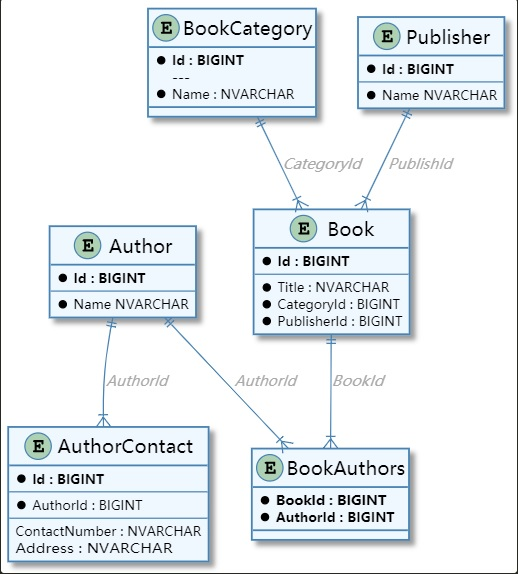

# DbEntity Service Sample Application

The example originated from this [post](https://code-maze.com/asp-net-core-web-api-with-ef-core-db-first-approach/) on code maze.  The original
post use `EF Core`.  We borrowed the sample and replaced `EF Core` with `DbEntityService` to illustrate the usage of this library.

## Changes to the Original Example

1. Relationship of `Author` to `AuthorContact` was changed from 1-to-1 to 1-to-many as the library
   didn't support 1-to-1 relationship yet.

2. Namespaces were changed to make it follow the solution namespace.

## Database Structure of Sample Application

